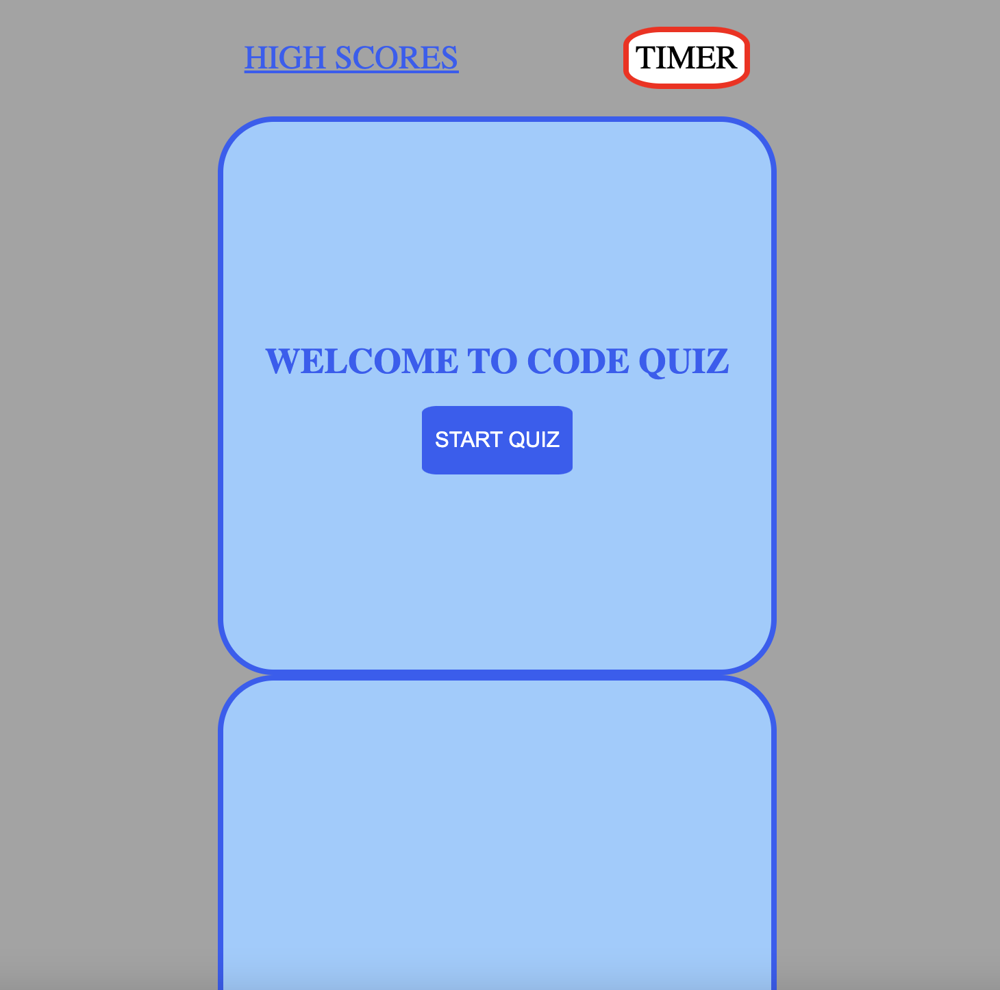

# week-4-code-quiz

## User Story

AS A coding boot camp student
I WANT to take a timed quiz on JavaScript fundamentals that stores high scores
SO THAT I can gauge my progress compared to my peers

## Challenges to complete

GIVEN I am taking a code quiz

- WHEN I click the start button THEN a timer starts and I am presented with a question

- WHEN I answer a question THEN I am presented with another question

- WHEN I answer a question incorrectly THEN time is subtracted from the clock

- WHEN all questions are answered or the timer reaches 0 THEN the game is over

- WHEN the game is over THEN I can save my initials and score

### Solutions

- When the user clicks the start quiz button, a series of questions will appear for the quiz and a timer is presented which starts counting down from 75 seconds.

- When the user answers/finishes a question they are then presented with the next one.

- Could not work out how to do the third point, subtract time from clock with wrong answer.

- The game stops when the user gets through all the questions or the counter gets down to zero.

- They are presented with a 'enter initials' box to enter their name and save their score when the game is over.

## Webpage screenshot

## LINKS

http://localhost:52330/quiz.html

https://github.com/LouisJsummers/week-4-code-quiz
